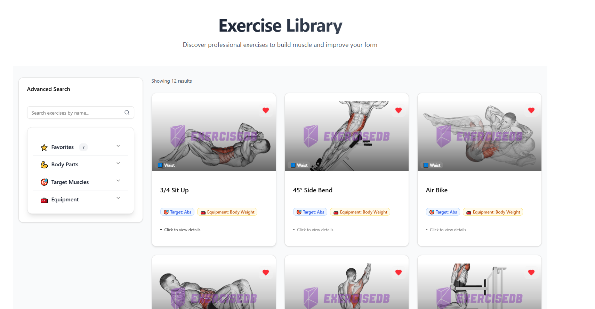

# 🏋️‍♂️ Exercise Explorer

Modern, hızlı ve filtreleme destekli bir egzersiz arama uygulaması. Vücut bölgesi, hedef kas veya ekipmana göre filtreleyebilir, detaylarını inceleyebilirsiniz.

 <!-- Varsa bir ekran görüntüsü ekleyin -->

---

## 🚀 Özellikler

- 🔍 **Egzersiz Arama** (isimle)
- 🧠 **Filtreleme**: Vücut bölgesi, hedef kas veya ekipman
- 📦 **RapidAPI ExerciseDB** üzerinden canlı veri
- 💡 **Açılır pencerede detaylar**
- 🌀 **Sayfalama (Pagination)**
- ⚡ Vite + React + TypeScript

---

## 📦 Kurulum

```bash
git clone https://github.com/sebahattinn/VatanSoft.git
cd VatanSoft
npm install
npm run dev
```

> `.env` dosyasına `VITE_RAPIDAPI_KEY` eklemeyi unutmayın.

---

## ⚙️ .env Örneği

```env
VITE_RAPIDAPI_KEY=your_api_key
```

---

## 🧱 Proje Yapısı

```
src/
├── api/                # Axios config ve API katmanı
├── components/         # UI bileşenleri (card, filtre, liste vs.)
├── hooks/              # Custom React hook'lar
├── services/           # API abstraction hook'ları
├── types/              # TypeScript tip tanımları
├── utils/              # LocalStorage, query key yönetimi
```

---

## 🧑‍💻 Kullanılan Teknolojiler

- [React](https://react.dev/)
- [Vite](https://vitejs.dev/)
- [TypeScript](https://www.typescriptlang.org/)
- [TanStack Query (React Query)](https://tanstack.com/query/latest)
- [Radix UI](https://www.radix-ui.com/)
- [TailwindCSS](https://tailwindcss.com/)
- [ExerciseDB API](https://rapidapi.com/justin-WFnsXH_t6/api/exercisedb)

---

## 🖼 Örnek Kullanım

- Ana sayfa: Arama + filtre alanı + egzersiz kartları
- Egzersize tıklanınca modal açılır, detayları gösterir
- "Daha Fazla Yükle" ile sayfalama yapılır

---

## 🤝 Katkıda Bulunmak

PR'lar, bug fix'ler ve iyileştirmeler memnuniyetle kabul edilir.

---
